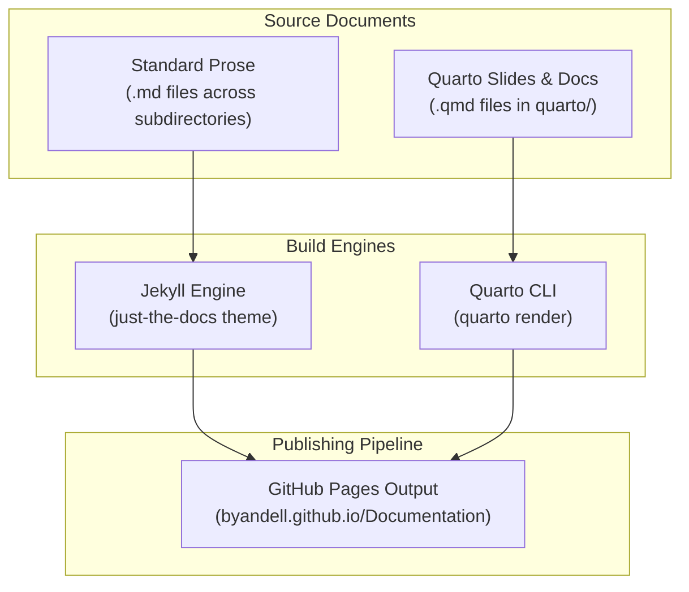

# Developer Architecture & Maintenance Guide

This document serves as the developer-facing architecture and maintenance reference for Brian Yandell's (`byandell`) personal documentation repository, published at [byandell.github.io/Documentation](https://byandell.github.io/Documentation) and versioned on [GitHub](https://github.com/byandell/Documentation).

For system-level rules and AI pair-programming instructions, see [`AGENTS.md`](AGENTS.md). For high-level repository index and landing pages, see [`README.md`](README.md).

---

## Architecture & Rendering Pipeline

The documentation suite combines **Jekyll** static site generation with **Quarto** document processing to render technical articles, code walkthroughs, interactive presentations, and slide decks.



### Key Configuration Files

- [`_config.yml`](_config.yml): Primary Jekyll configuration file. Specifies the `just-the-docs/just-the-docs` remote theme, enables relative link resolution via `jekyll-relative-links`, configures Mermaid diagram rendering (v10.9.1), and defines default page layout templates.
- [`_quarto.yml`](_quarto.yml): Configures Quarto website compilation, rendering output directly into the root/target directory.
- [`.gitignore`](.gitignore): Excludes build artifacts, scratch spaces, and local cache files.

---

## Repository Directory Layout

The codebase is organized into topic-focused folders, each backed by a dedicated `README.md` index file:

| Path | Description | Key Reference Files |
|---|---|---|
| [`R/`](R/README.md) | R programming notes, data structures, and packages | [`R/README.md`](R/README.md), [`R/radian.md`](R/radian.md) |
| [`python/`](python/README.md) | Python programming notes, scripts, and environments | [`python/README.md`](python/README.md), [`python/strategy.md`](python/strategy.md) |
| [`github/`](github/README.md) | Git, GitHub Pages, Actions, Shinylive & web publishing | [`github/README.md`](github/README.md), [`github/pages.md`](github/pages.md), [`github/shinylive.md`](github/shinylive.md) |
| [`envsys/`](envsys/README.md) | Environmental data science, ESIIL, Maka Sitomniya & spatial analysis | [`envsys/README.md`](envsys/README.md), [`envsys/geospatial.md`](envsys/geospatial.md) |
| [`AI/`](AI/README.md) | AI tools, LLM concepts, agent architecture & prompts | [`AI/README.md`](AI/README.md), [`AI/agents.md`](AI/agents.md), [`AI/LLM.md`](AI/LLM.md) |
| [`datasci/`](datasci/README.md) | Data science methods, big data handling, statistical significance | [`datasci/README.md`](datasci/README.md), [`datasci/bigdata.md`](datasci/bigdata.md), [`datasci/signif.md`](datasci/signif.md) |
| [`quarto/`](quarto/README.md) | Quarto presentations, slides, and rendered HTML decks | [`quarto/README.md`](quarto/README.md), [`quarto/AI.qmd`](quarto/AI.qmd), [`quarto/R.qmd`](quarto/R.qmd) |
| [`shiny/`](shiny/README.md) | Shiny app architecture, modules, and package integration | [`shiny/README.md`](shiny/README.md), [`shiny/foundrShiny.md`](shiny/foundrShiny.md), [`shiny/qtl2shiny.md`](shiny/qtl2shiny.md) |
| [`prompts/`](prompts/README.md) | Walkthroughs, prompt engineering recipes & developer guides | [`prompts/README.md`](prompts/README.md), [`prompts/devel_guide.md`](prompts/devel_guide.md), [`prompts/devel_guide_qtl2shiny.md`](prompts/devel_guide_qtl2shiny.md) |
| [`watson/`](watson/guide.md) | Watson developer guides and historical transcripts | [`watson/guide.md`](watson/guide.md), [`watson/chronology.md`](watson/chronology.md) |
| [`scripts/`](scripts/check_links.py) | Python automation utilities for link checking and annotations | [`scripts/check_links.py`](scripts/check_links.py), [`scripts/add_glyphs.py`](scripts/add_glyphs.py) |
| [`images/`](images/) | Image assets and diagrams referenced across pages | Static visual assets |

### Additional Root-Level Documents

- [`README.md`](README.md): Primary entry point and site navigation index.
- [`AGENTS.md`](AGENTS.md): Machine-readable pairing rules, vector subsetting notes, and style guidelines.
- [`AGENTS_mini.md`](AGENTS_mini.md): Concise condensed variant of developer rules.
- [`guides.md`](guides.md): Centralized guide overview linking key topic areas.
- [`todo.md`](todo.md): Active task list and pending documentation fixes.
- [`link_check_report.md`](link_check_report.md): Automated external link validation audit report.
- [`prompts/README.md`](prompts/README.md): Living reference index of prompt engineering recipes and workflow examples.

---

## Development & Maintenance Workflows

### 1. Link Checking & Health Auditing

External URLs across all Markdown (`.md`), Quarto (`.qmd`), and R Markdown (`.Rmd`) files are monitored using [`scripts/check_links.py`](scripts/check_links.py).

To execute a full multi-threaded scan and update [`link_check_report.md`](link_check_report.md):

```bash
python3 scripts/check_links.py --update-report
```

Key arguments for [`scripts/check_links.py`](scripts/check_links.py):
- `--timeout 15`: Set request timeout in seconds (default: 10).
- `--threads 20`: Adjust thread pool size (default: 16).
- `--file <path>`: Audit a single file instead of the full workspace.
- `--update-report`: Generate and write the audit output directly into [`link_check_report.md`](link_check_report.md).

For detailed link auditing practices, see [`prompts/check_links.md`](prompts/check_links.md) and [`prompts/broken_links.md`](prompts/broken_links.md).

### 2. Broken Link Annotation (Glyphs)

When external links are identified as permanently unreachable, flag them with a visual warning icon (`⚠️`). The [`scripts/add_glyphs.py`](scripts/add_glyphs.py) utility automates glyph insertion:

```bash
python3 scripts/add_glyphs.py
```

### 3. Rendering Quarto Presentations & Documents

Slides in [`quarto/`](quarto/README.md) are rendered to standalone HTML using the Quarto CLI:

```bash
quarto render quarto/
```

Individual `.qmd` files can be rendered independently:

```bash
quarto render quarto/AI.qmd --to revealjs
```

### 4. Local Preview with Jekyll

To preview the full `just-the-docs` Jekyll site locally:

```bash
bundle exec jekyll serve
```

Access the preview locally at `http://localhost:4000/Documentation/`.

---

## Code & Documentation Conventions

### Frontmatter Metadata

All documentation pages rendered by Jekyll must include YAML frontmatter at the top of the file:

```yaml
---
title: "Page Title"
parent: "Parent Category Title" # Optional: for nested navigation hierarchy
nav_order: 5                  # Controls sorting order in sidebar
permalink: /category/page/     # Optional: explicit URI path override
---
```

### Relative Path Hygiene

- **Always use relative paths** for internal document links. Prefer relative markdown links (e.g. `[R Notes](R/README.md)` or `[Developer Blueprint](prompts/devel_guide.md)`) over hardcoded full URLs.
- Relative links ensure seamless navigation both on local preview environments (`http://localhost:4000/Documentation/`) and published GitHub Pages (`byandell.github.io/Documentation`).
- Verify relative link targets using [`scripts/check_links.py`](scripts/check_links.py).

### Version Control & File History Conventions

- **Never overwrite historical versioned files** (e.g., `script_v1.R`, `analysis_v2.py`) when committing multi-stage work histories.
- Follow multi-version commit patterns and modular workflow guidelines as detailed in [`prompts/workflow.md`](prompts/workflow.md) and [`AGENTS.md`](AGENTS.md).
- Do **not** execute automatic `git commit` or `git push` in AI pair-programming sessions. Leave staging, committing, and pushing for manual review by the user.

---

## AI Pair-Programming & Developer Blueprints

This repository serves as both a reference site and a testbed for AI agent pairing strategies.

- **Developer Guide Blueprints**: When constructing developer documentation for R packages, Python projects, or hybrid systems, refer to the blueprints in:
  - [`prompts/devel_guide.md`](prompts/devel_guide.md): Universal blueprint for R, Python, and Documentation developer guides.
  - [`prompts/devel_guide_qtl2shiny.md`](prompts/devel_guide_qtl2shiny.md): Detailed case study for R/Shiny package developer guides (`qtl2shiny`).
- **AI Agent Guidance**: Refer to [`AGENTS.md`](AGENTS.md) for vector subsetting rules, package namespacing preferences (`pkg::func()`), and technical writing standards.

---

## Related Repositories & Ecosystem

- [`byandell-sysgen`](https://github.com/byandell-sysgen): Systems genetics repositories and R Shiny applications (`qtl2shiny`, `foundrShiny`).
- [`byandell-envsys`](https://github.com/byandell-envsys): Environmental data science code and Maka Sitomniya notebooks.
- [`AttieLab-Systems-Genetics`](https://github.com/AttieLab-Systems-Genetics): Collaborative genetics repositories.
- [`byandell/geyser`](https://github.com/byandell/geyser): Multi-language Shiny examples (R and Python) and developer guides.
