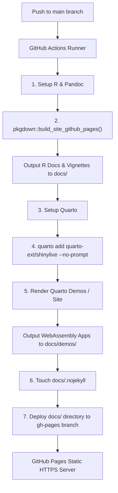

# Deploy with GitHub Actions

This guide explains how to set up GitHub Actions workflows to build and deploy Quarto websites and `pkgdown` package documentation directly to [GitHub Pages](pages.md).

Automating deployment via GitHub Actions keeps your repository clean and lightweight by avoiding tracking generated assets (like `site_libs/`, `.html` pages, or WebAssembly binaries) in your `main` branch.

## Table of Contents

- [Workflow Architecture](#workflow-architecture)
- [Single Quarto Website Workflow](#single-quarto-website-workflow)
- [Combined `pkgdown` & Quarto Shinylive Workflow](#combined-pkgdown--quarto-shinylive-workflow)
- [Key Architecture Decisions & Gotchas](#key-architecture-decisions--gotchas)
  - [Subfolder Project Roots & Extension Paths](#subfolder-project-roots--extension-paths)
  - [Shinylive WebAssembly Execution Requirements](#shinylive-webassembly-execution-requirements)
  - [WebAssembly `libcurl` Network Limitations](#webassembly-libcurl-network-limitations)
  - [Jekyll Disablement (`.nojekyll`) & Missing Pages](#jekyll-disablement-nojekyll--missing-pages)
  - [Jupyter/Python Kernel Fallbacks](#jupyterpython-kernel-fallbacks)
  - [Clean Git Repository & `.gitignore`](#clean-git-repository--gitignore)
- [GitHub Pages Repository Settings](#github-pages-repository-settings)
- [Local Verification & Server Testing](#local-verification--server-testing)
- Related Topics
  - [Shinylive Performance Tradeoffs](shinylive.md)
  - [Use `pkgdown` to Auto-Build GitHub Website](pkgdown.md)

---

## Workflow Architecture

The deployment pipeline automates checking out code, setting up R/Quarto environments, compiling documentation and WebAssembly applications, and publishing static output to GitHub Pages.



---

## Single Quarto Website Workflow

For standard Quarto websites rendered directly into `docs/` and published via GitHub Pages artifact deployment:

Create `.github/workflows/deploy.yml`:

```yaml
name: Deploy to GitHub Pages

on:
  push:
    branches: [ main, master ]
  workflow_dispatch:

permissions:
  contents: read
  pages: write
  id-token: write

concurrency:
  group: "pages"
  cancel-in-progress: false

jobs:
  deploy:
    environment:
      name: github-pages
      url: ${{ steps.deployment.outputs.page_url }}
    runs-on: ubuntu-latest
    steps:
      - name: Checkout
        uses: actions/checkout@v4

      - name: Set up R
        uses: r-lib/actions/setup-r@v2
        with:
          use-public-rspm: true

      - name: Install R package dependencies
        run: |
          install.packages(c("rmarkdown", "knitr", "shinylive", "bslib", "shiny", "ggplot2", "dplyr", "DT", "rlang", "stringr", "tibble"))
        shell: Rscript {0}

      - name: Install local package (if site depends on it)
        run: |
          R CMD INSTALL .

      - name: Set up Quarto
        uses: quarto-dev/quarto-actions/setup@v2

      - name: Install Quarto Shinylive Extension
        working-directory: docs
        run: |
          quarto add --no-prompt quarto-ext/shinylive

      - name: Render Website
        run: |
          quarto render docs/

      - name: Disable Jekyll for GitHub Pages
        run: touch docs/.nojekyll

      - name: Setup Pages
        uses: actions/configure-pages@v5

      - name: Upload artifact
        uses: actions/upload-pages-artifact@v3
        with:
          path: 'docs/'

      - name: Deploy to GitHub Pages
        id: deployment
        uses: actions/deploy-pages@v4
```

---

## Combined `pkgdown` & Quarto Shinylive Workflow

When building an R package website where `pkgdown` generates reference documentation and Quarto renders serverless WebAssembly Shinylive applications (e.g. into `docs/demos/`), use `.github/workflows/pkgdown.yaml`:

```yaml
name: pkgdown & Quarto Shinylive Deploy

on:
  push:
    branches: [ main, master ]
  workflow_dispatch:

jobs:
  pkgdown:
    runs-on: ubuntu-latest
    permissions:
      contents: write
    steps:
      - uses: actions/checkout@v4

      - uses: r-lib/actions/setup-pandoc@v2
      - uses: r-lib/actions/setup-r@v2

      - uses: r-lib/actions/setup-r-dependencies@v2
        with:
          extra-packages: any::pkgdown, any::shinylive, any::knitr, any::rmarkdown, local::.
          needs: website

      # Step 1: Build pkgdown site and vignettes into docs/
      - name: Build site
        run: pkgdown::build_site_github_pages(new_process = FALSE, install = FALSE)
        shell: Rscript {0}

      # Step 2: Setup Quarto
      - name: Set up Quarto
        uses: quarto-dev/quarto-actions/setup@v2

      # Step 3: Install Shinylive extension dynamically and render demos
      - name: Render Quarto Demos
        run: |
          mkdir -p docs/demos
          cd demos
          quarto add quarto-ext/shinylive --no-prompt
          quarto render
        shell: bash

      # Step 4: Disable Jekyll processing to preserve _extensions and site_libs
      - name: Disable Jekyll for GitHub Pages
        run: touch docs/.nojekyll
        shell: bash

      # Step 5: Publish compiled docs/ folder to gh-pages branch
      - name: Deploy to GitHub pages 🚀
        if: github.event_name != 'pull_request'
        uses: JamesIves/github-pages-deploy-action@v4
        with:
          clean: false
          branch: gh-pages
          folder: docs
```

---

## Key Architecture Decisions & Gotchas

### Subfolder Project Roots & Extension Paths

If your Quarto project is located in a subdirectory (like `docs/` or `demos/`), Quarto treats that subdirectory as the project root (looking for `_quarto.yml` there).

- **Issue**: Running `quarto add` in the root folder installs extensions into `/_extensions`, but Quarto only scans `/demos/_extensions`.
- **Fix**: Change into the subfolder before executing extension commands:
  ```bash
  cd demos && quarto add quarto-ext/shinylive --no-prompt
  ```

### Shinylive WebAssembly Execution Requirements

Shinylive executes browser WebAssembly (`webR`) workers and service workers (`shinylive-sw.js`).

- **Issue**: Browser security policies block WebWorkers inside self-contained data URIs (`embed-resources: true`). In addition, the Shinylive Lua filter outputs a warning block: `#| '!! shinylive warning !!': | #| shinylive does not work in self-contained HTML documents.`
- **Fix**: Always specify non-self-contained mode in your `.qmd` or `_quarto.yml`:
  ```yaml
  format:
    html:
      embed-resources: false
      self-contained: false
  ```

### WebAssembly `libcurl` Network Limitations

- **Issue**: Functions like `bslib::font_google()` attempt network calls using R's native `libcurl` C library bindings. Inside browser WebAssembly (`webR`), R system-level networking is unavailable, causing application launch failures.
- **Fix**: Load Google Fonts using standard HTML/CSS `<link>` imports inside `shiny::tags$head` instead of `bslib::font_google()`.

### Jekyll Disablement (`.nojekyll`) & Missing Pages

- **Issue**: GitHub Pages default Jekyll engine ignores folders/files beginning with underscores (`_quarto.yml`, `_extensions/`, `docs/demos/_metadata.yml`, `site_libs/`) and parses WebAssembly JS assets as Liquid templates, causing 404 errors.
- **Fix**: Add `touch docs/.nojekyll` to your workflow before deployment.

### Jupyter/Python Kernel Fallbacks

- **Issue**: If Quarto detects Python syntax or fails to resolve Knitr configurations in `.qmd` files, it attempts to launch a Python 3 Jupyter kernel, failing on clean runners.
- **Fix**: Explicitly set the rendering engine in YAML headers:
  ```yaml
  engine: knitr
  ```

### Clean Git Repository & `.gitignore`

Configure Git to ignore compiled HTML/JS/CSS assets so source commits remain lightweight:

```gitignore
# Quarto & pkgdown generated website assets
/docs/*.html
/docs/site_libs/
/docs/_extensions/
/docs/shinylive-sw.js
/docs/app.json
/docs/demos/
```

To untrack previously committed build files:

```bash
git rm --cached -r docs/
git commit -m "Untrack compiled site assets"
```

---

## GitHub Pages Repository Settings

After pushing workflow files:

1. Navigate to **Settings** > **Pages** in your GitHub repository.
2. Under **Build and deployment** > **Source**:
   - For `actions/deploy-pages@v4`: Select **GitHub Actions**.
   - For `JamesIves/github-pages-deploy-action@v4`: Select **Deploy from a branch**, choose **`gh-pages`**, and set folder to **`/ (root)`**.
3. Enable **Read and write permissions** under **Settings** > **Actions** > **General** > **Workflow permissions** if deploying via `gh-pages` branch.

---

## Local Verification & Server Testing

Because browser WebWorkers require valid HTTP/HTTPS origins, double-clicking generated `.html` files in a local file browser (`file://`) will fail to run Shinylive apps.

To test locally:

```bash
# 1. Build pkgdown documentation site
Rscript -e "pkgdown::build_site_github_pages(new_process = FALSE, install = FALSE)"

# 2. Render Quarto Shinylive demos into docs/demos
mkdir -p docs/demos
cd demos && quarto render && cd ..

# 3. Disable Jekyll
touch docs/.nojekyll

# 4. Preview locally over HTTP
python3 -m http.server 8000 --directory docs
```

Navigate to `http://localhost:8000` in your web browser.
