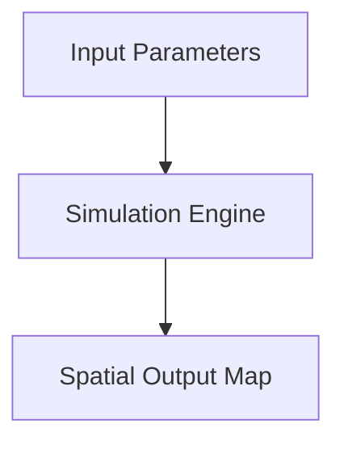

# Use `pkgdown` to Auto-Build GitHub Website

`pkgdown` is an R package designed to automatically generate a complete, searchable documentation website for R packages.

When combined with Quarto WebAssembly Shinylive applications (e.g. in `demos/`), `pkgdown` serves as the primary portal for package reference, vignettes, and interactive demonstration applications.

---

## Directory & Repository Layout

In a dual `pkgdown` + Quarto Shinylive package repository, source files and build outputs are organized as follows:

```
my-r-package/
├── _pkgdown.yml              # Main pkgdown navbar & article configuration
├── DESCRIPTION               # R package metadata & dependencies
├── .Rbuildignore             # Anchored exclusions for pkgdown & CI/CD files
├── .gitignore                # Untracked build directories (docs/)
├── R/                        # R package source code
├── vignettes/                # R Markdown & Quarto articles/vignettes
├── demos/                    # Quarto Shinylive source project directory
│   ├── _quarto.yml           # Quarto website config (output-dir: ../docs/demos)
│   └── *.qmd                 # Interactive WebAssembly Shinylive apps
└── docs/                     # Compiled static output directory (deployed to gh-pages)
    ├── .nojekyll             # Disables GitHub Pages Jekyll processing
    ├── index.html            # Main pkgdown homepage
    ├── reference/            # Function reference pages
    ├── articles/             # Rendered vignettes
    └── demos/                # Compiled Quarto Shinylive gallery
        ├── index.html        # Demos gallery landing page
        ├── site_libs/        # Shinylive & WebAssembly JS/CSS assets
        └── *.html            # Compiled app pages
```

---

## What `pkgdown` Generates

`pkgdown` compiles source files into `docs/` containing:

1. **Homepage**: Rendered directly from your root `README.md`.
2. **Function Reference**: Formats `.Rd` files (generated from `roxygen2` comments) into readable reference pages with syntax highlighting.
3. **Articles & Vignettes**: Compiles R Markdown (`.Rmd`) and Quarto (`.qmd`) files in `vignettes/` into hosted articles.
4. **News**: Parses `NEWS.md` to present a chronological changelog.
5. **Interactive Demos (Optional)**: Integrates custom Quarto Shinylive apps rendered into `docs/demos/`.

---

## Engineering Design Patterns for Interactive Demos

### A. WebAssembly Package Installation (`webr::install`)

To eliminate code and data duplication between R package source files (`R/`, `data/`) and browser-side Shinylive applications, use `webr::install()` inside `{shinylive-r}` code blocks:

```r
```{shinylive-r}
#| standalone: true
#| viewerHeight: 800
#| components: [viewer]

webr::install("username/repository")
library(myPackage)

myAppLauncher()
```

```

This 5-line standard architecture enables `webR` to load the installed package namespace directly, ensuring 100% parity with package code without requiring build-time string splicing or file duplication.

Unfortunately, if the `repository` is large or has
multiple dependencies, this approach will be too
burdensome. An alternative is to use some type of
shinylive_helpers.R script to bundle only the
needed routines, such as is done with the
[Shinylive Demos Guide for ewing Package](https://github.com/byandell/ewing/blob/master/inst/doc/demo_guide.md).

On a broken page, it is possible to check the DevTools Console: Press `F12` (or `Cmd + Option + I`) in your browser and check the **Console** tab:

* Look for red errors like `SharedArrayBuffer is not defined` (signals missing cross-origin isolation).
* Look for `Uncaught (in promise)` or missing package binaries.


### B. Navigation & Cross-Site Link Integration

To connect `pkgdown` and Quarto Shinylive galleries seamlessly:

1. **Main Site Navbar (`_pkgdown.yml`)**:
   Add a top-level **Demos** tab in your main package navbar:

   ```yaml
   navbar:
     structure:
       left: [intro, reference, demos, articles, news]
       right: [search, github]
     components:
       demos:
         text: Demos
         href: demos/index.html
   ```

1. **Demos Site Return Navigation (`demos/_quarto.yml`)**:
   Point the **Home** link in Quarto's navbar back to `../index.html`:

   ```yaml
   website:
     title: "Package Demos"
     navbar:
       left:
         - href: ../index.html
           text: Home
         - href: app1.qmd
           text: App 1
   ```

### C. Mermaid Diagram Rendering in Vignettes & Articles

`pkgdown` compiles ````mermaid` code blocks in `.Rmd` vignettes into `<pre class="mermaid"><code>...</code></pre>`. Because`pkgdown` does not natively load Mermaid.js, browser visitors will see plain text code blocks unless the library is explicitly injected into the HTML template.

To enable automatic Mermaid rendering across all articles, add `in_header` script and CSS overrides to `_pkgdown.yml`:

```yaml
template:
  bootstrap: 5
  includes:
    in_header: |
      <script src="https://cdn.jsdelivr.net/npm/mermaid@10/dist/mermaid.min.js"></script>
      <style>
        pre.mermaid {
          background: transparent !important;
          border: none !important;
          box-shadow: none !important;
          text-align: center;
        }
      </style>
      <script>
        document.addEventListener("DOMContentLoaded", function() {
          mermaid.initialize({ startOnLoad: true });
        });
      </script>
```

#### Usage in R Markdown Vignettes (`vignettes/*.Rmd`)

Once configured in `_pkgdown.yml`, write standard `mermaid` code blocks directly in `.Rmd` files:

```markdown


```

---

## GitHub Actions & Deployment Walkthrough

Detailed deployment workflow step-by-step instructions are documented in [Deploy with GitHub Actions](actions.md).

Key setup tasks include:

1. **Created `_pkgdown.yml`**: Configured Bootstrap 5 styling, custom navbar, and article grouping.
2. **Updated `.Rbuildignore`**: Added anchored regex patterns to ignore config files from package builds:
   ```regex
   ^_pkgdown\.yml$
   ^\.github$
   ^docs$
   ^vignettes/devel_guide$
   ```

   *Note*: Anchoring patterns with `^` and `$` is critical to prevent `R CMD check` from accidentally ignoring internal package paths (such as `inst/doc/`).
3. **Updated `.gitignore`**: Added `docs` to keep local compiled HTML assets out of Git commits.
4. **Created `.github/workflows/pkgdown.yaml`**: Set up automated `pkgdown` + `quarto render demos` deployment pipeline.
5. **Configured `Remotes` in `DESCRIPTION`**: Specified non-CRAN GitHub dependencies so CI runners can resolve and install them automatically.
6. **Disabled Jekyll (`.nojekyll`)**: Included `touch docs/.nojekyll` step in CI pipeline to prevent GitHub Pages from ignoring directories with leading underscores (like `_quarto.yml`, `_extensions/`, `site_libs/`) and causing 404 errors.

---

## Gotchas & Troubleshooting

### Subdirectory Articles in `_pkgdown.yml` Must Be Quoted

When grouping vignettes in subdirectories (e.g. `vignettes/devel_guide/`) under `contents:` in `_pkgdown.yml`, **paths must be enclosed in quotes**:

- **Incorrect**:

  ```yaml
  articles:
    - title: "Developer Documentation"
      contents:
        - devel_guide/index
  ```

  *Error*: `! could not find function "/"` (YAML evaluates unquoted slashes as division).
- **Correct**:

  ```yaml
  articles:
    - title: "Developer Documentation"
      contents:
        - "devel_guide/index"
  ```

### Relative Links Between Vignettes

In source `.Rmd` or `.qmd` files within subdirectories, format relative links to point to final `.html` destinations (e.g. `[Architecture](./architecture.html)`), not `.Rmd` or `.md`.

### Mermaid Diagrams Not Displaying in `vignettes/`

Because `pkgdown` builds static HTML into `docs/` and disables Jekyll (`touch docs/.nojekyll`), Jekyll `_config.yml` settings (such as `mermaid: version: "..."`) have **no effect**. Mermaid JS must be loaded via `template: includes: in_header:` in `_pkgdown.yml`.

---

## Local Build & Verification Command

Run the complete local build sequence from R and shell:

```bash
# 1. Build pkgdown documentation site
Rscript -e "pkgdown::build_site_github_pages(new_process = FALSE, install = FALSE)"

# 2. Render Quarto Shinylive demos (if applicable)
mkdir -p docs/demos
cd demos && quarto render && cd ..

# 3. Disable Jekyll
touch docs/.nojekyll

# 4. Preview locally over HTTP
python3 -m http.server 8000 --directory docs
```

Navigate to `http://localhost:8000/` to test site navigation and Shinylive apps.
