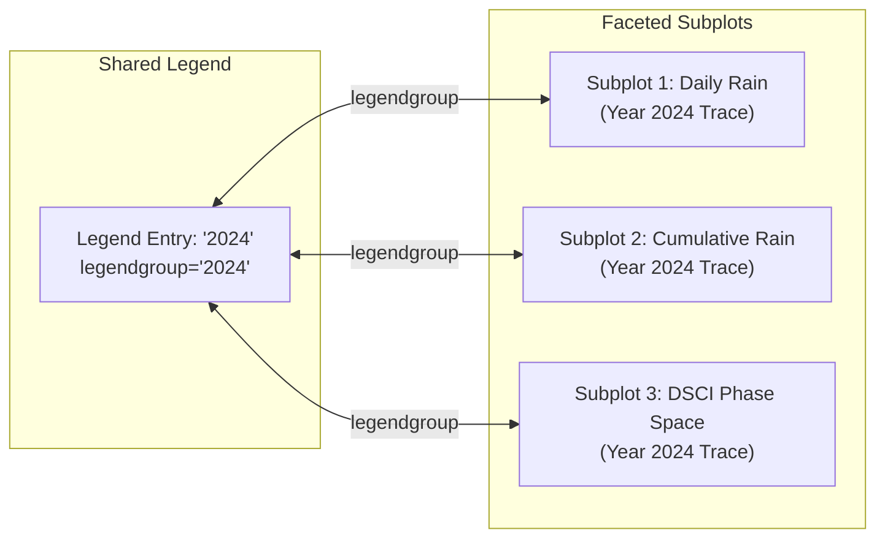
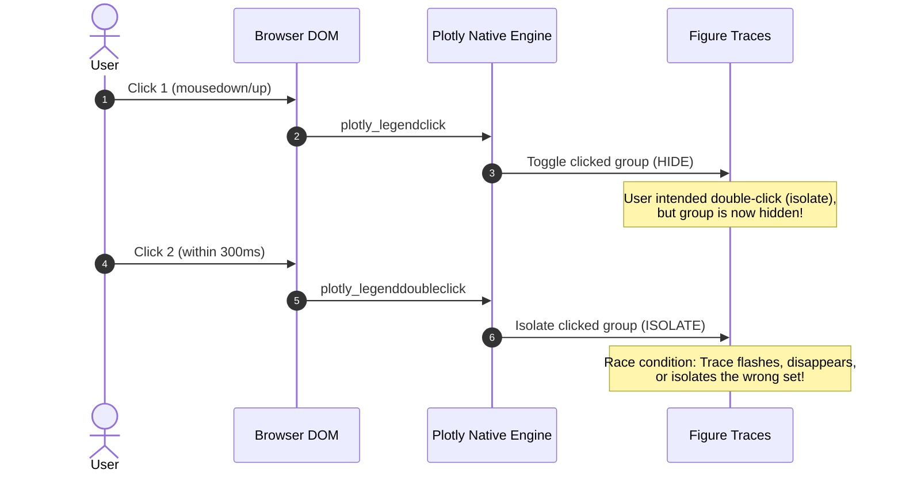
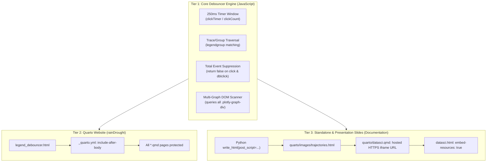

# Plotly Legend Debouncer & Quarto Iframe Embedding

This case study documents the diagnosis, iterative debugging, and resolution of two intertwined technical challenges encountered when embedding complex interactive Plotly dashboards across Quarto websites ([`rainDrought`](https://github.com/byandell/rainDrought)) and Quarto Reveal.js presentation slide decks ([`Documentation`](https://github.com/byandell/Documentation)):

1. **The Plotly Legend Race Condition**: Single-click toggle vs. double-click isolate race conditions on faceted subplots linked with `legendgroup`.
2. **The Quarto Reveal.js Iframe Data-URI Trap**: `embed-resources: true` converting multi-megabyte interactive HTML widgets into browser-blocked `data:text/html;base64,...` URIs.

---

## The Problem: Anatomy of the Plotly Legend Race Condition

In interactive visualization tools (such as precipitation and drought trajectories in `rainDrought`), annual series are plotted across multiple faceted subplots (e.g., daily time series, cumulative progression, and phase-space trajectories). Each year's traces (lines and markers) across subplots share the same `legendgroup`:



### Expected User Interaction

- **Single Click**: Toggle visibility of the clicked year (`legendgroup`) on or off across all subplots.
- **Double Click**: Isolate the clicked year (hide all other years), or if already isolated, restore all years.

### What Actually Happened (Plotly Event Stream)

Plotly's native event dispatcher fires a single click (`plotly_legendclick`) immediately on the first mousedown/mouseup cycle of a double-click before detecting the second click:



---

## Why Earlier Attempts Failed (The Iteration Log)

Multiple iterations were attempted before arriving at the robust multi-tier solution. Understanding why each failed provides valuable insights for web and data science workflows:

| Attempt | Approach | Why It Failed |
|---|---|---|
| **1. Built-in Layout Flags** | `legend.groupclick="togglegroup"`, `legend.itemdoubleclick="toggleothers"`, `config.doubleClickDelay` | Plotly's internal event loop still executes the single-click toggle callback on the first click of a double-click gesture before `itemdoubleclick` evaluates. |
| **2. Naive JS Selector** | Custom listener attached to `document.getElementsByClassName('plotly-graph-div')[0]` | Pages with multiple figures (e.g. `plot_records.qmd` with 3 plots) only attached the debouncer to the first graph div. The 2nd and 3rd plots remained broken. |
| **3. Partial Event Interception** | Intercepting `plotly_legendclick` with a 250ms timer without suppressing `plotly_legenddoubleclick` | Plotly's native isolate logic fired concurrently with the custom timer's double-click handler, leading to duplicate and conflicting `Plotly.restyle` mutations. |
| **4. Python-Only Post-Scripts** | Injecting debouncer script via `pio.to_html(..., post_script=...)` or `fig._repr_html_` | In Quarto documents (`plot_records.qmd`), Python chunks emit native Jupyter widget JSON (`fig.show()`), completely bypassing Python's `to_html` post-script pipeline. |
| **5. Local Iframe in Slides** | Embedding `<iframe src="images/trajectories.html">` with `embed-resources: true` in Reveal.js | Pandoc converted the 4.9MB HTML file into an inline `data:text/html;base64,...` URI. Modern browsers block large data URIs in iframes due to URL length limitations and security sandboxing. |

---

## The Complete Solution Architecture

To solve the problem across all delivery surfaces (Python scripts, Quarto websites, and Quarto Reveal.js presentation slides), a 3-tier architecture was implemented:



---

## Tier 1: The Core JavaScript Debouncer Implementation

The JavaScript debouncer intercepts all legend click events, buffers clicks within a 250ms window, restyles all traces sharing the target `legendgroup`, and cancels native Plotly double-click handling:

```javascript
(function() {
    function attachDebouncedLegend(gd) {
        if (!gd || !gd.on || gd._debouncedLegendAttached) return;
        gd._debouncedLegendAttached = true;

        var clickTimer = null;
        var clickCount = 0;
        var lastGroup = null;
        var lastCurve = null;

        function performSingleClick(group, curveNumber) {
            if (!gd.data || gd.data.length === 0) return;
            var currentVisible = gd.data[curveNumber] ? gd.data[curveNumber].visible : true;
            var newVisible = (currentVisible === 'legendonly') ? true : 'legendonly';
            var update = { visible: [] };

            for (var i = 0; i < gd.data.length; i++) {
                var trace = gd.data[i];
                if (group !== null && group !== undefined && group !== '') {
                    // Match all traces across subplots sharing the same legendgroup
                    if (trace.legendgroup === group) {
                        update.visible.push(newVisible);
                    } else {
                        update.visible.push(trace.visible !== undefined ? trace.visible : true);
                    }
                } else {
                    if (i === curveNumber) {
                        update.visible.push(newVisible);
                    } else {
                        update.visible.push(trace.visible !== undefined ? trace.visible : true);
                    }
                }
            }
            Plotly.restyle(gd, update);
        }

        function performDoubleClick(group, curveNumber) {
            if (!gd.data || gd.data.length === 0) return;
            var otherVisible = false;
            for (var i = 0; i < gd.data.length; i++) {
                var trace = gd.data[i];
                var isMatch = (group !== null && group !== undefined && group !== '') 
                    ? (trace.legendgroup === group) 
                    : (i === curveNumber);
                if (!isMatch && trace.visible !== 'legendonly') {
                    otherVisible = true;
                    break;
                }
            }
            var update = { visible: [] };
            for (var i = 0; i < gd.data.length; i++) {
                var trace = gd.data[i];
                var isMatch = (group !== null && group !== undefined && group !== '') 
                    ? (trace.legendgroup === group) 
                    : (i === curveNumber);
                if (otherVisible) {
                    update.visible.push(isMatch ? true : 'legendonly');
                } else {
                    update.visible.push(true);
                }
            }
            Plotly.restyle(gd, update);
        }

        function resetState() {
            clickCount = 0;
            lastGroup = null;
            lastCurve = null;
            clickTimer = null;
        }

        // Intercept single click
        gd.on('plotly_legendclick', function(data) {
            var curveNumber = data.curveNumber;
            var group = (data.data && data.data[curveNumber]) ? data.data[curveNumber].legendgroup : null;

            // If user clicked a different legend item while a timer was running, flush the previous click
            if (clickTimer && (group !== lastGroup || (group === null && curveNumber !== lastCurve))) {
                clearTimeout(clickTimer);
                performSingleClick(lastGroup, lastCurve);
                resetState();
            }

            clickCount++;
            lastGroup = group;
            lastCurve = curveNumber;

            if (clickCount === 1) {
                var targetGroup = group;
                var targetCurve = curveNumber;
                clickTimer = setTimeout(function() {
                    performSingleClick(targetGroup, targetCurve);
                    resetState();
                }, 250);
            } else if (clickCount >= 2) {
                if (clickTimer) clearTimeout(clickTimer);
                var targetGroup = group;
                var targetCurve = curveNumber;
                performDoubleClick(targetGroup, targetCurve);
                resetState();
            }

            return false; // Suppress native single-click behavior
        });

        // Intercept and suppress native double-click to prevent race conditions
        gd.on('plotly_legenddoubleclick', function() {
            return false;
        });
    }

    // Attach to all graph divs on the page (initial load and dynamically rendered widgets)
    function initAllPlots() {
        var divs = document.querySelectorAll('.plotly-graph-div, .js-plotly-plot');
        divs.forEach(function(gd) {
            if (gd.on && gd.data) attachDebouncedLegend(gd);
        });
    }

    if (document.readyState === 'loading') {
        document.addEventListener('DOMContentLoaded', initAllPlots);
    } else {
        initAllPlots();
    }
    window.addEventListener('load', initAllPlots);
    var interval = setInterval(initAllPlots, 300);
    setTimeout(function() { clearInterval(interval); }, 8000);
})();
```

---

## Tier 2: Quarto Website Integration (`rainDrought`)

To ensure every `.qmd` notebook automatically includes the debouncer without modifying Python code cells, save the script as `legend_debouncer.html` in the repository root and register it in `_quarto.yml`:

```yaml
project:
  type: website
  output-dir: docs

format:
  html:
    theme: cosmo
    toc: true
    include-after-body:
      - legend_debouncer.html
```

---

## Tier 3: Standalone Export & Quarto Reveal.js Embedding (`Documentation`)

### Standalone Export via Python

For standalone figures generated via CLI (`run_analysis.py`), embed the debouncer directly into the HTML using `post_script`:

```python
from rainDrought.visualizations import LEGEND_DEBOUNCED_POST_SCRIPT

fig.write_html(
    "quarto/images/trajectories.html", 
    post_script=LEGEND_DEBOUNCED_POST_SCRIPT,
    include_plotlyjs="cdn"
)
```

### Embedding in Quarto Reveal.js (`datasci.qmd`)

When building a standalone presentation slide deck with `embed-resources: true`, referencing a local HTML file via `<iframe src="images/trajectories.html">` causes Pandoc to base64-encode the 4.9MB widget into `src="data:text/html;base64,..."`. Modern web browsers reject large data URI frames due to memory boundaries and security sandboxing.

**The Fix**: Use the hosted GitHub Pages URL in the `iframe` `src` while keeping `embed-resources: true` for the rest of the slide deck:

```markdown
---
title: "Data Sciences"
format:
  revealjs:
    theme: [default, custom.scss]
    embed-resources: true
resources:
  - "images/trajectories.html"
---

## Cumulative Trajectories

<iframe src="https://byandell.github.io/Documentation/quarto/images/trajectories.html" 
        width="100%" 
        height="500px" 
        style="border:none;">
</iframe>
```

---

## Verification & Testing Recipe

To verify the debouncer behavior across all figures:

1. **Single Click Test**:
   - Click a single year (e.g., `2024`) in the legend.
   - Confirm that all associated line and marker traces across all subplots toggle visibility after exactly 250ms.
2. **Double Click Test**:
   - Double-click a year in rapid succession (<250ms).
   - Confirm that the clicked year is isolated immediately without any initial flicker or disappearance.
   - Double-click the year again; confirm that all other years are restored.
3. **Cross-Item Rapid Click Test**:
   - Click year `2023`, then immediately click year `2024`.
   - Confirm that `2023`'s single-click toggles and `2024`'s single-click toggles smoothly without dropped events.
4. **Slide Deck Iframe Test**:
   - Open `quarto/datasci.html` in a web browser.
   - Verify that the embedded trajectory widget loads smoothly and interactivity remains responsive.

---

_[byandell.github.io/Documentation](https://byandell.github.io/Documentation)_
