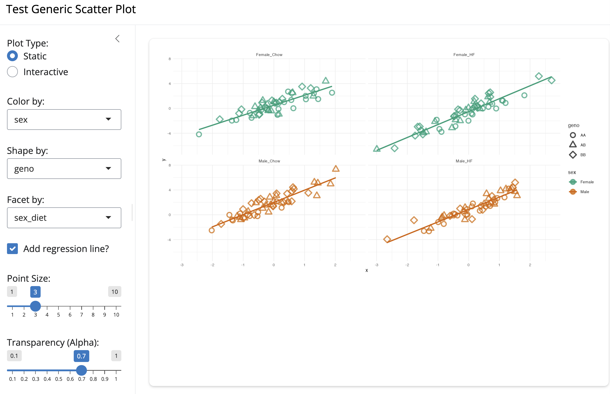

# Data Sciences Overview

- [What is Data Science?](#what-is-data-science)
- [Making Sense of Data & Statistical Significance](#making-sense-of-data--statistical-significance)
- [Data Sovereignty & Open Science](#data-sovereignty--open-science)
- [Big Data & Data Repositories](#big-data--data-repositories)

# What is Data Science? {background-color="#e0f2fe"}

## Perspectives on Data Sciences

Data science approaches vary widely depending on context, discipline, background, goals, and available tools.

### My Journey
- Pure mathematics → Statistics → Data Science.
- Informal coding background driven by real-world research problems.
- Evolution from statistical consulting to interdisciplinary collaboration.
- Systems trajectory: Ecology → Agriculture → Health → Environment.

### Key Concepts
- Data sciences bridge **computational thinking**, **quantitative methods**, and **domain expertise**.
- Focus on how communities use data to understand health, environment, and local decision-making.
- Part of the broader effort to [Document Digital Tools](../README.md).

## Blog Perspectives: `byandell.github.io`

Insights from personal blog publications on the evolution of data science:

::: {.incremental}
- **[What is Data Science?](https://byandell.github.io/What-is-Data-Science/)**: Framing data science as an evolving discipline blending math, statistics, computer science, and domain inquiry.
- **[Data Evolve](https://byandell.github.io/Data-Evolve)**: Tracing how tools, languages (S → R, Python, Julia), and algorithms evolve alongside data scale.
- **[Data Science Collaboratory](https://byandell.github.io/Data-Sciences-Collaboratory/)**: Moving from transactional consulting to deep collaborative partnerships across research domains.
- **[Data Science Across Liberal Arts](https://byandell.github.io/Data-Science-across-the-Liberal-Arts/)**: Broadening data literacy beyond STEM into humanities, ethics, and social inquiry.
- **[Strategic Planning](https://byandell.github.io/Data-Models-and-Statistics/)**: Integrating statistics, experimental design, and predictive models into organizational decision-making.
- **[Data Science Quotes](https://byandell.github.io/Useful-Data-Science-Quotes/)**: Principles of data visualization, statistical caution, and scientific reasoning.
:::

# Making Sense of Data & Statistical Significance {background-color="#e0f2fe"}

## Significance vs. Importance

::: {.callout-important}
### Crucial Distinction
**Statistical significance** measures whether an observed pattern could occur by chance under a null model.
**Importance** addresses whether a result is meaningful, actionable, and relevant to the domain problem.
- Statistical significance does **not** imply importance.
- Importance does **not** depend solely on statistical significance.
- Large sample sizes can produce highly "statistically significant" yet practically trivial effects.
:::

::: {.incremental}
- **Test or Plot?**: Plotting data first explores underlying patterns, non-linearities, and outliers before jumping to formal testing.
- Visualizations are more effective and informative than raw test summary tables.
:::

## Scatter Plots & Relational Visualization

Scatter (*X-Y*) plots investigate relationships among measurements, augmented with color, symbol shape, trend lines, and facets.

{fig-align="center" width="90%"}

[`scattyr`](https://byandell.github.io/scattyr/) repo plots in `R` ([`ggplot2`](https://ggplot2.tidyverse.org/)) and `Python` ([`plotnine`](https://plotnine.readthedocs.io/)) with color, symbol shape, and facets to reveal data patterns.

##  Analytical Pitfalls to Avoid

- **Spurious Association**: Confounding variables causing apparent relationships.
- **Multiple Testing**: Uncorrected testing across vast arrays of features guarantees false discoveries.
- **$p$-Hacking**: Data dredging or selective reporting to reach $p < 0.05$.

## Spatial & Temporal Autocorrelation

Complex environmental and biological systems present unique analytical challenges:

::: {.columns}

::: {.column width="50%"}
### Autocorrelation Challenges
- Measurements over space and time are inherently correlated.
- Nearby locations (e.g., rainfall in a valley) are autocorrelated.
- Arbitrary spatial/temporal resolution (daily vs. drought duration; land cover vs. county boundaries).
- Standard statistical independence assumptions often fail.
:::

::: {.column width="50%"}
### Cumulative Measures
- Cumulative metrics (e.g., cumulative rain & drought) handle autocorrelation better than instantaneous rates.
- Example Case Study: [Rain & Drought Analysis](https://byandell.github.io/rainDrought/) examining Oglala Lakota (Pine Ridge) and Sicangu (Rosebud) counties using `plotnine` in Python.
:::

:::

## Cumulative Trajectories

<iframe src="images/trajectories.html" width="100%" height="500px" style="border:none;"></iframe>

# Data Sovereignty & Open Science {background-color="#e0f2fe"}

## Balancing Open Data & Data Sovereignty

There is an ongoing tension between the **open data movement** and **data sovereignty**—the inherent right of Indigenous communities and local groups to govern data collected from their people, lands, and resources.

::: {.columns}

::: {.column width="50%"}
### Open Science
- Accelerates scientific discovery and reproducibility.
- Public data repositories and open algorithms.
- **FAIR Principles**: Findable, Accessible, Interoperable, Reusable.
:::

::: {.column width="50%"}
### Data Sovereignty
- Protects community rights, privacy, and cultural heritage.
- Local governance and control over access/use.
- **CARE Principles**: Collective Benefit, Authority to Control, Responsibility, Ethics.
:::

:::

## Indigenous Data Governance Frameworks

Key initiatives and frameworks shaping Indigenous data science:

::: {.incremental}
- **[Data Sovereignty](https://byandell.github.io/Data-Sovereignty/) & [Indigenous Data Science](https://byandell.github.io/pages/indigenous/)**: Synthesizing governance practices and sovereign data management.
- **[US Indigenous Data Network (USIDN)](https://usindigenousdatanetwork.org/)**: Supporting tribal data governance and capacity.
- **[Indigenous Data Alliance](https://indigenousdata.org/)**: Promoting Indigenous data rights globally.
- **[CARE Data Maturity Model](https://indigenousdatalab.org/care-data-maturity-model/)**: Evaluating organizational alignment with CARE principles.
- **[Tiered Sovereign Data Framework](https://atniclimate.github.io/TieredSovereignDataFramework/)**: Operationalizing tiered access controls for sovereign data.
:::

# Big Data & Data Repositories {background-color="#e0f2fe"}

## Understanding Big Data: The 3 Vs, 6 Vs, and 3 Us

Big data refers to datasets exceeding the processing capacity of traditional database systems and analysis tools.

::: {.columns}

::: {.column width="33%"}
### Original 3 Vs
- **Volume**: Scale of data.
- **Velocity**: Speed of streaming/generation.
- **Variety**: Diversity of formats.
:::

::: {.column width="33%"}
### Expanded 6 Vs
- **Veracity**: Trustworthiness.
- **Validity**: Accuracy.
- **Volatility**: Rate of change.
:::

::: {.column width="33%"}
### Statistical 3 Us
- **Unknowns**: Unmeasured factors.
- **Uncertainty**: Measurement noise.
- **Unfamiliarity**: Novel data structures.
:::

:::

## Open Data Repositories & Resources

Platforms and repositories supporting modern data science workflows:

::: {.incremental}
- **Open Science & AI Platforms**:
  - [Open Source Program Office (OSPO)](https://dsi.wisc.edu/initiatives/ospo/): UW-Madison open research initiative.
  - [Hugging Face](https://huggingface.co/): Open repository for machine learning models and datasets.
  - [Kaggle](https://www.kaggle.com/): Community platform for datasets, notebooks, and challenges.
- **Data Science Guides in this Site**:
  - [Significance and Importance](../datasci/signif.md)
  - [Data Repositories](../datasci/repositories.md)
  - [Big Data Reference](../datasci/bigdata.md)
:::

# Conclusion & Next Steps {background-color="#e0f2fe"}

## Summary & Learning Path

::: {.incremental}
- **Statistical Thinking**: Prioritize data visualization and clear reasoning over blind statistical testing.
- **Contextual Awareness**: Account for spatial/temporal autocorrelation and cumulative effects.
- **Responsible Governance**: Balance FAIR open science with CARE Indigenous data sovereignty principles.
- **Explore Resources**: Visit the full [Data Sciences Index](../datasci/README.md) and companion slide decks ([R](R.html), [Python](python.html), [AI](AI.html)).
:::

---

_[byandell.github.io/Documentation](https://byandell.github.io/Documentation)_
