# foundrShiny: pragmatic code reuse driven by collaborators

The [foundrShiny](https://github.com/AttieLab-Systems-Genetics/foundrShiny) R package provides interactive web portals for analyzing and visualizing multiparent founder study data (such as Attie Lab founder mouse diet and calcium studies). It serves as the modular interactive web companion to the core analytical package [`foundr`](https://github.com/AttieLab-Systems-Genetics/foundr).

### Active Study Portals
- [Founder Calcium Study](https://connect.doit.wisc.edu/FounderCalciumStudy/)
- [Founder Diet Study](https://connect.doit.wisc.edu/FounderDietStudy/) (requires authentication)
- [Founder Liver Diet Study](https://connect.doit.wisc.edu/FounderLiverDietStudy/) (requires authentication)

---

## High-Level Architecture & Reactivity Flow

`foundrShiny` contains over 30 interconnected Shiny modules organized hierarchically. Parameter modules (`mainParServer`, `panelParServer`, `plotParServer`) scope inputs at different levels, while tab panel routers (`traitServer`, `contrastServer`, `statsServer`, `timeServer`, `aboutServer`) manage active analytical views:

```mermaid
flowchart TD
    foundrApp["foundrApp / foundrServer"]
    entryServer["entryServer (Auth)"]
    panelServer["panelServer (5-Tab Router)"]

    mainParServer["mainParServer (Global Parameters)"]
    panelParServer["panelParServer (Panel Parameters)"]
    plotParServer["plotParServer (Plot Parameters)"]

    traitServer["traitServer (Trait Panel)"]
    contrastServer["contrastServer (Contrast Panel)"]
    statsServer["statsServer (Stats Panel)"]
    timeServer["timeServer (Time Panel)"]
    aboutServer["aboutServer (About Panel)"]

    corPlotApp["corPlotApp"]
    corTableApp["corTableApp"]
    traitNamesApp["traitNamesApp"]
    traitOrderApp["traitOrderApp"]
    traitPairsApp["traitPairsApp"]
    traitSolosApp["traitSolosApp"]
    traitTableApp["traitTableApp"]

    contrastGroupApp["contrastGroupApp"]
    contrastTimeApp["contrastTimeApp"]
    contrastTableApp["contrastTableApp"]
    contrastTraitApp["contrastTraitApp"]
    timePlotApp["timePlotApp"]
    contrastPlotApp["contrastPlotApp"]
    timeTraitsApp["timeTraitsApp"]
    timeTableApp["timeTableApp"]

    biplotApp["biplotApp"]
    dotplotApp["dotplotApp"]
    volcanoApp["volcanoApp"]

    foundrApp --> entryServer
    foundrApp --> panelServer

    panelServer --> mainParServer
    panelServer --> traitServer
    panelServer --> contrastServer
    panelServer --> statsServer
    panelServer --> timeServer
    panelServer --> aboutServer

    %% Trait Panel Sub-modules
    traitServer --> panelParServer
    traitServer --> corPlotApp
    traitServer --> corTableApp
    traitServer --> traitNamesApp
    traitServer --> traitOrderApp
    traitServer --> traitPairsApp
    traitServer --> traitSolosApp
    traitServer --> traitTableApp

    %% Contrast Panel Sub-modules
    contrastServer --> panelParServer
    contrastServer --> contrastGroupApp
    contrastServer --> contrastTimeApp
    contrastServer --> contrastTableApp
    contrastServer --> contrastTraitApp
    contrastServer --> timePlotApp

    contrastGroupApp --> contrastPlotApp
    contrastTableApp --> traitOrderApp
    contrastTimeApp --> timeTraitsApp
    contrastTraitApp --> contrastPlotApp

    contrastPlotApp --> plotParServer
    contrastPlotApp --> biplotApp
    contrastPlotApp --> dotplotApp
    contrastPlotApp --> volcanoApp

    biplotApp --> mainParServer
    biplotApp --> panelParServer
    biplotApp --> plotParServer
    biplotApp --> contrastTableApp

    %% Stats Panel Sub-modules
    statsServer --> panelParServer
    statsServer --> contrastPlotApp

    %% Time Panel Sub-modules
    timeServer --> panelParServer
    timeServer --> timePlotApp
    timeServer --> timeTableApp

    timeTableApp --> timeTraitsApp
    timeTableApp --> traitOrderApp
```

---

## Published Developer Guide Articles

Comprehensive technical documentation, module indexes, and parameter reactivity pipelines are published on GitHub Pages at [https://byandell-sysgen.github.io/foundrShiny/articles/devel_guide](https://byandell-sysgen.github.io/foundrShiny/articles/devel_guide):

- **[Developer Guide Overview & Architecture](https://byandell-sysgen.github.io/foundrShiny/articles/devel_guide/index.html)**  
  Package purpose, `foundr` / `foundrShiny` ecosystem split, local developer quick start, and system-wide reactivity flow.

- **[Shiny Module Index & Design Conventions](https://byandell-sysgen.github.io/foundrShiny/articles/devel_guide/modules.html)**  
  Details the 5-function Shiny module design pattern (`*Input`, `*UI`, `*Output`, `*Server`, `*App`), distinguishes Shiny modules from WGCNA trait modules, and categorizes all package modules into infrastructure, router, parameter, and plot components.

- **[Data Pipeline, Parameter Reactivity & Isolated Testing](https://byandell-sysgen.github.io/foundrShiny/articles/devel_guide/data_flow.html)**  
  Covers runtime data initialization via `foundrSetup()`, parameter scoping across `main_par`, `panel_par`, and `plot_par`, and standalone module test app runners (`*App()`).

---

## Code Repositories

- **`foundrShiny` Package Repository**: [AttieLab-Systems-Genetics/foundrShiny](https://github.com/AttieLab-Systems-Genetics/foundrShiny)
- **`foundr` Analytical Package Repository**: [AttieLab-Systems-Genetics/foundr](https://github.com/AttieLab-Systems-Genetics/foundr)
