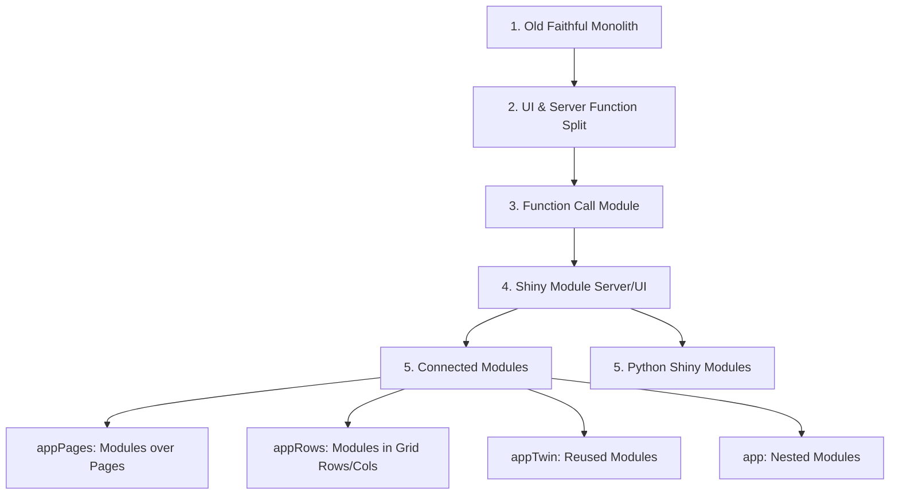

# geyser: modular concepts and construction

The [geyser](https://byandell.github.io/geyser) repository demonstrates how to take the classic [Faithful Geyser Shiny example](https://shiny.posit.co/r/gallery/start-simple/faithful) and systematically modularize it. It is published as both an R and Python package to illustrate multi-language Shiny module patterns, server/UI component separation, and WebAssembly deployment using Shinylive.

## Progressive Modularization Flow

The repository demonstrates a step-by-step transition from monolithic Shiny code to decoupled multi-module architecture:

---

## Published Documentation & Interactive Demos

Documentation, live interactive demos, and slide decks are hosted online at [https://byandell.github.io/geyser/](https://byandell.github.io/geyser/):

### Developer Guides
- **[Architectural Overview (`DEVELOPER.md`)](https://byandell.github.io/geyser/DEVELOPER.html)**  
  High-level design blueprint, package structures, and directory layouts.
- **[R Developer Guide](https://byandell.github.io/geyser/vignettes/DeveloperGuide.html)**  
  Detailed guide for constructing and connecting Shiny modules in R.
- **[Python Developer Guide](https://byandell.github.io/geyser/docs/devel/python.html)**  
  Guide for building modular Shiny for Python applications (`shiny.express` & `shiny.ui`).

### Interactive Shinylive Demos
Explore live Shinylive applications running directly inside your browser without requiring a backend server:
- **[Demos Gallery](https://byandell.github.io/geyser/docs/demos/)**  
  Overview of all browser-executable demos.
- **[Build Module Demo](https://byandell.github.io/geyser/docs/demos/build_module.html)**  
  Interactive demonstration of single-module construction.
- **[Connect Modules Demo](https://byandell.github.io/geyser/docs/demos/connect_modules.html)**  
  Multi-module composition showing data flow across reactive components.
- **[Python Module Demo](https://byandell.github.io/geyser/docs/demos/python_module.html)**  
  Browser-based Python Shiny module demo.
- **[Quarto Shinylive Demo](https://byandell.github.io/geyser/docs/demos/quarto.html)**  
  Embedded Shinylive widgets rendered inside Quarto documents.

### Presentations & Slide Decks
- **[R Shiny Modules Presentation (`geyserShinyR`)](https://byandell.github.io/geyser/docs/geyserShinyR.html)**  
  Quarto slide deck covering R Shiny module mechanics.
- **[Python Shiny Modules Presentation (`geyserShinyPython`)](https://byandell.github.io/geyser/docs/geyserShinyPython.html)**  
  Quarto slide deck covering Shiny for Python module design patterns.

---

## Source Code & Repository

- **GitHub Repository**: [byandell/geyser](https://github.com/byandell/geyser)
- **Module Tutorial Code**: Sample code for module construction in [`inst/build_module`](https://github.com/byandell/geyser/tree/main/inst/build_module) and [`inst/connect_modules`](https://github.com/byandell/geyser/tree/main/inst/connect_modules).
