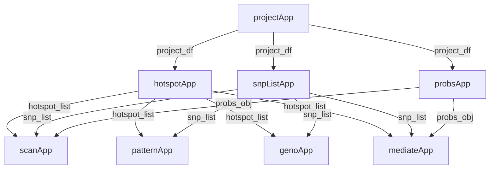

# qtl2shiny: localized QTL analysis and visualization

The [qtl2shiny](https://github.com/byandell-sysgen/qtl2shiny) package provides an interactive dashboard designed to investigate local Quantitative Trait Loci (QTL) within focused genomic regions (typically 1–4 Mb). It performs allele-based LOD scans, SNP-based association mapping, SNP distribution pattern analysis, and candidate gene mediation.

## Architecture & Modernization

`qtl2shiny` has been modernized from legacy monolithic scripts and `shinydashboard` layouts to a responsive **Bootstrap 5 (`bslib`)** architecture. The application is organized into over 40 focused Shiny modules (`R/*App.R`) structured across six main analysis panels.

### Module Communication & Data Flow

Modules communicate by passing reactive values (such as project metadata, phenotype selections, and genotype probabilities) down through panel containers. The diagram below illustrates how key parent modules pass reactive data to downstream analysis panels:

---

## Online Developer Guide Articles

Detailed technical documentation for the package data structures, query functions, and module interfaces is published on GitHub Pages at [https://byandell-sysgen.github.io/qtl2shiny/articles/devel_guide](https://byandell-sysgen.github.io/qtl2shiny/articles/devel_guide):

- **[Developer Guide Overview](https://byandell-sysgen.github.io/qtl2shiny/articles/devel_guide/index.html)**  
  Covers folder organization (`qtl2shinyData`), project configuration (`projects.csv`), genotype probability storage (`fst`), and SQL query routines for genes and variants.

- **[Module Architecture](https://byandell-sysgen.github.io/qtl2shiny/articles/devel_guide/module.html)**  
  Describes the `bslib` dashboard layout, sidebar parameters, reactive module communication, and unified download framework (`downr` integration).

- **[Hotspots & Phenotypes Panel (`hotspotApp`)](https://byandell-sysgen.github.io/qtl2shiny/articles/devel_guide/hotspot.html)**  
  Details project loading, genome-wide hotspot count scans (`hotspotScanApp`), raw phenotype distribution plots (`phenoPlotApp`), and phenotype summary tables (`phenoTableApp`).

- **[Allele & SNP Scans Panel (`scanApp`)](https://byandell-sysgen.github.io/qtl2shiny/articles/devel_guide/scan.html)**  
  Details LOD scan plots, founder allele effect estimates (`scanCoefApp`), and SNP-based association mapping (`snpScanApp`).

- **[Patterns Panel (`patternApp`)](https://byandell-sysgen.github.io/qtl2shiny/articles/devel_guide/pattern.html)**  
  Covers strain distribution pattern grouping (`patternScanApp`) and imputed SNP effect visualizations.

- **[Genotypes Panel (`genoApp`)](https://byandell-sysgen.github.io/qtl2shiny/articles/devel_guide/geno.html)**  
  Details allele pair probability visualizations (`genoPlotApp`), gene region track plots (`geneRegionApp`), and exon boundary inspection (`geneExonApp`).

- **[Scatter Plot Modules (`scatterApp`)](https://byandell-sysgen.github.io/qtl2shiny/articles/devel_guide/scatter.html)**  
  Covers bivariate phenotype scatter plots, mediator trait comparisons (`scatterPlotApp`), and interactive table selections.

- **[Mediation Panel (`mediateApp`)](https://byandell-sysgen.github.io/qtl2shiny/articles/devel_guide/mediate.html)**  
  Details causal mediation scans (`mediateScanApp`) for prioritizing candidate genes near QTL peaks.

---

## Related References

- [Developer Process Documentation](https://byandell.github.io/Documentation/prompts/devel_guide.html)
- [qtl2shiny Package Repository](https://github.com/byandell-sysgen/qtl2shiny)
